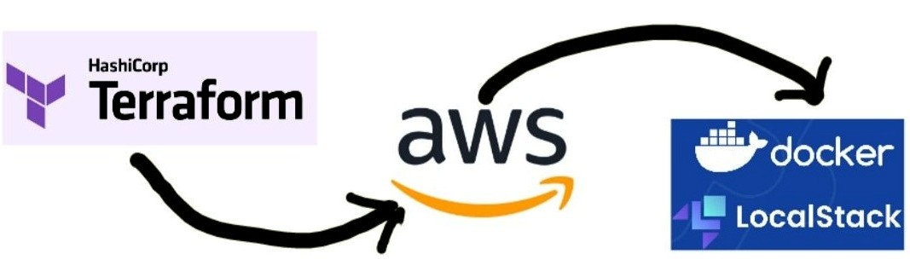

# Terraform-aws-localstack
This repo helps to establish a local environment to simulate Infrastructure as a Code (IaaC) on aws using LocalStack and Terraform. This repo successfully tested in `Ubuntu 18.04 LTS` and `python3.8`.




### Install terraform in your local environment
#### Linux/Ubuntu
As per the [Terraform documentation](https://developer.hashicorp.com/terraform/downloads) 

- `wget -O- https://apt.releases.hashicorp.com/gpg | sudo gpg --dearmor -o /usr/share/keyrings/hashicorp-archive-keyring.gpg`

- `echo "deb [signed-by=/usr/share/keyrings/hashicorp-archive-keyring.gpg] https://apt.releases.hashicorp.com $(lsb_release -cs) main" | sudo tee /etc/apt/sources.list.d/hashicorp.list`

- `sudo apt update && sudo apt install terraform`

#### Verify the installation
- `terraform -help`
- `terraform -help init`
- `terraform -help plan`
- `terraform -help apply`

### Install aws-CLI in your local environment
#### Linux/Ubuntu
As per the [AWS documentation](https://docs.aws.amazon.com/cli/latest/userguide/getting-started-install.html), install the AWS CLI in your local environment.

- `curl "https://awscli.amazonaws.com/awscli-exe-linux-x86_64.zip" -o "awscliv2.zip"`
- `unzip awscliv2.zip`
- `sudo ./aws/install`

Verify AWS CLI is installed by running
- `aws --version`

Configure credentials for accessing AWS services by running the below command. Once `aws configure` runs, it prompts access key, secret eky, region, and output format. 
- `aws configure`
    - AWS Access Key ID: test
    - AWS Secret Access Key: test
    - Default region name: us-east-1
    - Default output format: json
 
### Install localstack CLI in your local environment
LocalStack depends on the docker. To check if Docker already exists or not use following commands respectively.

- `which docker` 

#### Installing Docker 
- `sudo apt install curl -y`
- `curl -fsSL get.docker.com | bash`
- `docker --version`
- `docker pull localstack/localstack`

Test the installation of localstack on your local system

- `docker images`
- `docker ps`
- `localstack --help`
- `localstack --version`
- `curl http://localhost:4566`


Now let's install the Infrastructure as a Code (Iaac) using terraform.

#### Test the terraform in your local
- clone the repo and ```cd terraform-aws-localstack```

**Step-1**: Run the `terraform init` command that downloads necessary packages specific service provider.
- `terraform init`

**Step-2**: Run `terraform plan` command that validates the terraform script and describes entire plan of infra that is going to create on aws cloud.   
- `terraform plan` 

**Step-3**: Run `terraform apply` command that trying ot create your Infra on specific provider.
- `terraform apply --auto-approve`

If you add/modify any resources in your terraform then rerun the `Step-3` that only adds newly added service.


Check the list terraform states created
- `terraform state list`

If you would like to remove the terraform plan, run
- `terraform destroy --auto-approve`

#### Test the aws infra in localstack 

- Check for list of s3 bucket(s)
    - `aws --endpoint-url http://localhost:4566 s3 ls`
- Check for bucket has file is available or not. Assuming the bucket name: `raw-bucket-us-east-1`.
    - `aws --endpoint-url http://localhost:4566 s3://raw-bucket-us-east-1 ls`
- Check the subnets created by terraform 
    - `aws --endpoint-url http://localhost:4566 ec2 describe-subnets`


#### Multiple environments like dev and pre-prod/prod with different .tfvars. 

Terraform has to generate multiple .tfstate files. To accomplish this by using terraform workspaces.
- `terraform workspace show`

To create different environments that creates `terraform.tfstate.d` folder 
- `terraform workspace new dev`
- `terraform workspace new prod`
- `terraform workspace list`

To select an existing environment then run terraform command.
- `terraform workspace select default`


